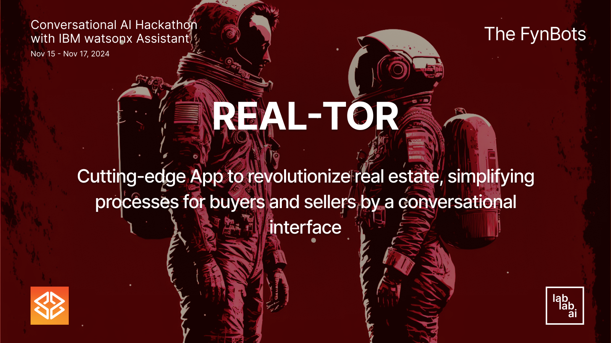

# REAL-TOR ✨ Real Estate AI Assistant

Cutting-edge app to revolutionize real estate, simplifying processes for buyers and sellers by a conversational interface.



## Introduction

Real-Tor is a cutting-edge application designed to revolutionize the real estate market by simplifying the process for both buyers and sellers. Utilizing an advanced AI  Assistant technology, the app offers a conversational interface where users can enter their real estate preferences and requirements.


## Key Features

* Personalized Recommendations: Tailored property suggestions based on user’s specific needs and past interactions.
* Task Automation: Automates various aspects of real estate transactions, from scheduling viewings to managing paperwork, reducing the time and effort involved.
* Enhanced User Experience: By integrating AI, the app significantly boosts user satisfaction by offering a more intuitive and efficient home buying or selling experience.

## Impact

* Increases homebuyer satisfaction by up to 25%.
* Reduces the time to buy or sell a home by up to 20%.
* Overall, it enhances the real estate experience by making it more user-friendly, efficient, and personalized.

Real-Tor aims to transform the traditional real estate market into a seamless, AI-driven platform where technology meets real estate to create a more enjoyable and less stressful process for all parties involved

## Technology Used

* IBM watsonx Assistant
* Meta Llama models: Llama 3.1 70B
* MongoDB Atlas
* Python 3.10
* Streamlit
* GenericSuite

## Getting Started

### Prerequisites

- [Python](https://www.python.org/downloads/) 3.10 or higher
- [Git](https://www.atlassian.com/git/tutorials/install-git)
- Make: [Mac](https://formulae.brew.sh/formula/make) | [Windows](https://stackoverflow.com/questions/32127524/how-to-install-and-use-make-in-windows)

### Installation

Clone the repository:
```bash
git clone https://github.com/tomkat-cr/real-tor.git
```

Navigate to the project directory:

```bash
cd real-tor
```

<!--
### Create the .env file

Create a `.env` file in the root directory of the project:

```bash
# You can copy the .env.example file in the root directory of the project
cp .env.example .env
```

The `.env` file should have the following content:

```bash
PYTHON_VERSION=3.10
#
# Together AI
TOGETHER_AI_API_KEY=
# OpenAI
OPENAI_API_KEY=
#
# Database parameters
DB_TYPE=mongodb
# DB_TYPE=json
#
# MongoDB database parameters
MONGODB_URI=mongodb+srv://<user>:<password>@<cluster>.mongodb.net
MONGODB_DB_NAME=real-tor-dev
#
# JSON database parameters
# JSON_DB_PATH=./db/conversations.json
```

Replace `TOGETHER_AI_API_KEY` and other access tokens with your actual Together.ai API key, OpenAI, Huggingface, Groq, Nvidia, and Rhymes API keys, respectively.

To use a MongoDB database, comment out `DB_TYPE=json`, uncomment `# DB_TYPE=mongodb`, and replace `YOUR_MONGODB_URI`, `YOUR_MONGODB_DB_NAME`, and `YOUR_MONGODB_COLLECTION_NAME` with your actual MongoDB URI, database name, and collection name, respectively.
-->

### Run the Application

```bash
# With Make
make run
```

```bash
# Without Make
sh ./public/scripts/run_app.sh run
```

## Usage

Go to your favorite Browser and open the URL provided by the application.

* Locally:<BR/>
  [http://localhost:3000](http://localhost:3000)

* Official App:<BR/>
  [https://real-tor.streamlit.app/](https://real-tor.streamlit.app/)

## Screenshots

Main Page


Main Page with IBM watsonx assistan opened


## Context

This project was developed as part of the [Conversational AI Hackathon with IBM watsonx Assistant](https://lablab.ai/event/ibm-watsonx-assistant) organized by [Lablab.ai](https://lablab.ai).


- Project submission page: [REAL-TOR](https://lablab.ai/event/ibm-watsonx-assistant/the-fynbots/real-tor)

- Presentation video: [Conversational AI Hackathon with IBM watsonx Assistant - REAL-TOR App Video Presentation](https://lablab.ai/event/ibm-watsonx-assistant/the-fynbots/real-tor)

<!--
- Presentation document: [Conversational AI Hackathon with IBM watsonx Assistant - REAL-TOR App Maker Presentation](https://storage.googleapis.com/lablab-static-eu/presentations/submissions/xxx.pdf)
-->

- Team: [The FynBots](https://lablab.ai/event/ibm-watsonx-assistant/the-fynbots)

## Contributors

[Carlos J. Ramirez](https://www.linkedin.com/in/carlosjramirez/)

Please feel free to suggest improvements, report bugs, or make a contribution to the code.

## License

This project is licensed under the terms of the MIT license. See the [LICENSE](LICENSE) file for details.

## Acknowledgements

* [IBM](https://www.ibm.com/) for developing the watsonx powerful technology.
* [Lablab.ai](https://lablab.ai) for organizing the [Conversational AI Hackathon with IBM watsonx Assistant](https://lablab.ai/event/ibm-watsonx-assistant).
* [Streamlit](https://streamlit.io/) for providing a user-friendly interface for interacting with the application.
* Open-source community for inspiring and supporting collaborative innovation.
* Users and contributors for their feedback and support.

